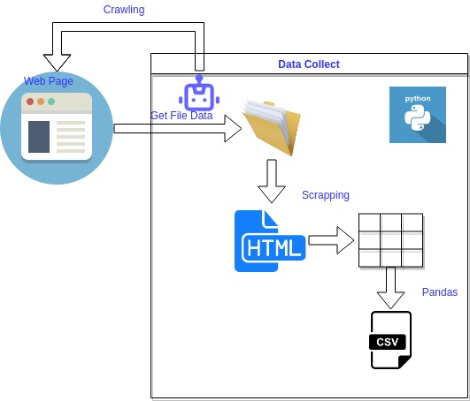

# Estaciones Hidrometeorológicas obtener Datos Pluviométricos
Automatizacion de la recolección de datos de Datos Pluviométricos desde la pagina web de UTE [https://apps.ute.com.uy/SgePublico/BajadasGE.aspx](https://apps.ute.com.uy/SgePublico/BajadasGE.aspx)


Gráficamente:



GitHub Pages: [https://ml-as-a-service.github.io/ute-estaciones-datos-pluviometricos/](https://ml-as-a-service.github.io/ute-estaciones-datos-pluviometricos/)

Tutorial en Youtube https://youtu.be/pnRjagjO13c :

[](https://www.youtube.com/watch?v=pnRjagjO13c)


## Instalación de dependencias
Instalamos las librerías dependientes desde requirements.txt

```bash
pip3 install -r requirements.txt
pip3 install chromedriver-binary
```

Revisar si tenemos instalado la última versión de chrome. O instalar la version que corresponda, ej en mi caso la version es chrome 104.0.5112.79

```bash
pip3 install chromedriver-binary==104.0.5112.79.0
```

## Ejecutar
Al ejecutar el comando

```bash
python3 run.py
```
Se procederá a:
- crear la estructura de directorios
- descargar los archivos con informacion raw en la carpeta  **./tmp/download/data_pluviometricos**
- exportar los archivos raw a formato csv en la carpeta **./data/data_pluviometricos**
- crear la estructura de cuenca, subcuenca, estacion y paso en el archivo **./data/ute_cuencas_subcuencas_estaciones_pasos.json**
- los logs del proceso estan en **./tmp/process.log**


 
